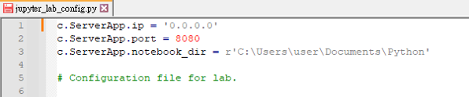
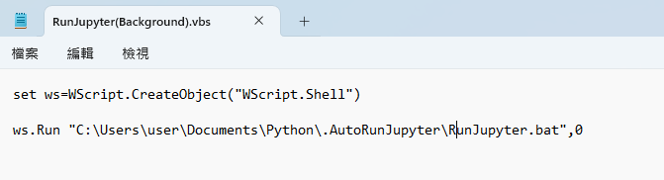

# Setting Remote Jupyter

An easy way for your **Jupyter Lab** or **Jupyter Notebook** to be operated remotely on any browser of any device. This makes your local computer as a server and automatically running it in the background. 

### **Step 1** : Install Jupyter
Install **Jupyter Lab** by the following command in cmd.

```cmd
pip install jupyterlab 
```


<br/>

### **Step 2** : Set Your Jupyter Password

Also enter the following command in cmd.
```cmd
jupyter server password
```


***Note:*** \
*The password needs to be enter twice, and the entered password will not be shown in the window.*

After finishing this step, there will be a file `jupyter_server_config.json` created in `C:\Users\user\.jupyter`.

<br/>

### **Step 3** : Create Configration File

```cmd 
jupyter lab --generate-config
```


The configuration file (`jupyter_lab_config.py`) will be automatically generated in  `C:\Users\user\.jupyter`.\

Then open this file and add the followings:

```python
c.NotebookApp.ip = '0.0.0.0'                  # Make Jupyter server to listen on all IPs.
c.NotebookApp.port = 8080                     # Set the port that server will listen on.
c.NotebookApp.notebook_dir = r'C:\Users\user' # Set the directory to use for notebooks.
```



Until now, it is already done to login your Jupyter server on any browser of any device. 

But you have to carefully keep the cmd window running on your local device. Once the window is closed, the entire server will shut down and every notebook and kernel will also be stopped. \
Therefore, the next step is a way to run the server in the background. 

<br/>

## **Step 4** : Run the Server in the Background
### 1. Create a `.bat` file

Open a notepad and enter the following command:

```bat
cmd /k "activate {env name} && jupyter lab"
```

After saving the file, change the `.txt` extension to `.bat` to create batch file.


***Note:*** \
*If you need to activate an environment, you can change "`{env name}`" to your environment name, Otherwise, "`activate {env name} &&`" can be directly removed.*

### 2. Create a `.vbs` file

The vbs file is going to execute the batch file created above in the background.

Open a notepad and enter:

```vbs
set ws=WScript.CreateObject("WScript.Shell")
ws.Run "{The path of the batch file}",0
```

Then save and change the `.txt` extension to `.vbs` to create vbs file. 



These commands is to run the `.bat` file in the background without showing any window. In this way, you don't have to worry about the Jupyter server shutting down accidentally.

<br/>

## **Step 5** : Add the `.vbs` File to Windows Task Scheduler

You can just add the created `.vbs` file to **Windows Task Scheduler** and specify that the it will be executed when your computer starts.